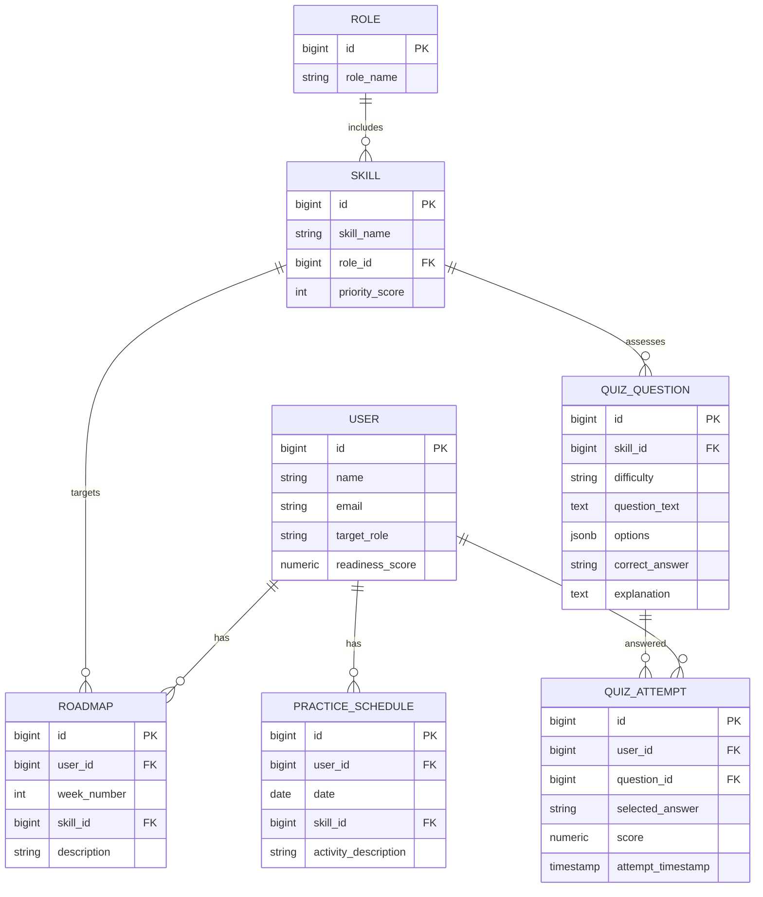

# AI Role-Based Adaptive Quiz & Preparation Platform (Backend)

Production-grade, modular monolith Spring Boot backend that provides:
- Role intelligence (AI-driven skill extraction and ranking)
- AI roadmap generation (weekly milestones, dependencies, time estimates)
- Adaptive quiz engine (AI question generation, dynamic difficulty/skill selection)
- Performance analytics (readiness score, strengths/weaknesses)
- Practice scheduler (daily prioritized plan)
- Security with JWT and role-based access control
- OpenAPI/Swagger documentation
- PostgreSQL with Flyway migrations
- Optional Redis caching and pgvector for embeddings
- Dockerized runtime

## Quickstart (Run Locally)

Prerequisites:
- Java 17+
- Maven 3.9+
- Docker + Docker Compose (for DB/Redis)

1) Start infrastructure (PostgreSQL + Redis)
- docker compose up -d

2) Configure (optional) AI provider
- Set env var for OpenAI key (optional for now; AI endpoints require a key)
  - Windows (CMD): set SPRING_AI_OPENAI_API_KEY=<your-key>
  - Windows (PowerShell): $env:SPRING_AI_OPENAI_API_KEY="<your-key>"
  - Linux/macOS (bash/zsh): export SPRING_AI_OPENAI_API_KEY=<your-key>

3) Build
- mvn clean package -Pdev

4) Run (dev profile)
- mvn spring-boot:run -Dspring-boot.run.profiles=dev

5) Explore APIs
- Swagger UI: http://localhost:8080/swagger-ui.html
- OpenAPI JSON: http://localhost:8080/v3/api-docs

Import the Postman collection at: postman/AdaptiveQuiz.postman_collection.json

## How To Run (Detailed)

Environments (application.yml):
- Default port: 8080
- Datasource (override via env):
  - SPRING_DATASOURCE_URL=jdbc:postgresql://localhost:5432/quizdb
  - SPRING_DATASOURCE_USERNAME=quiz
  - SPRING_DATASOURCE_PASSWORD=quiz

Profiles:
- dev: verbose Hibernate logs
- prod: reduced logs; adjust health exposure

Flyway Migrations:
- Auto-runs on startup from classpath:db/migration
- V1__init.sql provisions all normalized tables and indexes

Build commands:
- Dev: mvn clean package -Pdev
- Run: mvn spring-boot:run -Dspring-boot.run.profiles=dev
- Jar: java -jar target/hackathon-0.0.1-SNAPSHOT.jar

Dockerizing the app:
- docker build -t quiz-app:latest .
- docker run --rm -p 8080:8080 ^
  -e SPRING_DATASOURCE_URL=jdbc:postgresql://host.docker.internal:5432/quizdb ^
  -e SPRING_DATASOURCE_USERNAME=quiz ^
  -e SPRING_DATASOURCE_PASSWORD=quiz ^
  -e SPRING_AI_OPENAI_API_KEY=<your-key-optional> quiz-app:latest

Linux/macOS replace env syntax accordingly and use host networking/bridge IP as needed.

## Postman Collection

Path: postman/AdaptiveQuiz.postman_collection.json

- Uses variable {{baseUrl}} defaulting to http://localhost:8080
- Includes requests:
  - Role APIs:
    - POST /roles/analyze
    - GET /roles/{roleId}/skills
  - Roadmap APIs (placeholders)
    - POST /roadmap/generate/{userId}
    - GET /roadmap/{userId}
  - Quiz APIs (placeholders)
    - POST /quiz/start
    - POST /quiz/submit
    - GET /quiz/next-adaptive
  - Performance APIs (placeholders)
    - GET /performance/{userId}
    - GET /performance/readiness-score/{userId}
  - Schedule APIs (placeholders)
    - GET /schedule/{userId}

Import steps:
- Open Postman → Import → select postman/AdaptiveQuiz.postman_collection.json
- Set environment variable baseUrl = http://localhost:8080
- Execute requests; modify payloads if needed

## Architecture Overview

Design principles:
- Clean Architecture, SOLID: controllers → services → repositories; DTO/mapper separation from entities.
- Modular Monolith: package-by-feature; ready for microservices later.
- Hexagonal tendencies: AI integration behind a port (service interface), infra adapters via Spring AI.

High-level layering:
- Controller Layer (REST + Swagger)
- Service Layer (business logic, adaptive rule engine)
- Repository Layer (Spring Data JPA)
- AI Integration Layer (Spring AI wrappers + prompt templates)
- Domain Models (JPA entities)
- DTOs + Mappers (MapStruct)
- Security (Spring Security + JWT)
- Config (DB, Swagger, Caching, AI)
- Exception Handling (global handler)

### Suggested Package Structure (Modular Monolith)
```
com.hackathon.quiz
├─ controller
│  ├─ role
│  ├─ roadmap
│  ├─ quiz
│  ├─ performance
│  └─ schedule
├─ service
│  ├─ impl
│  └─ rules   (adaptive quiz rule engine + strategies)
├─ repository
├─ entity
├─ dto
│  ├─ request
│  └─ response
├─ mapper
├─ ai
│  ├─ prompt  (templates)
│  ├─ model   (LLM DTOs)
│  └─ impl    (OpenAI adapter via Spring AI)
├─ config
├─ exception
└─ validation
```

### ER/Data Model (Normalized)


Notes:
- pgvector for embeddings can be enabled later via a migration.
- JSONB used for options to support flexible choice formats.

## API Surface (Initial)

- Role APIs
  - POST /roles/analyze
  - GET /roles/{roleId}/skills
- Roadmap APIs
  - POST /roadmap/generate/{userId}
  - GET /roadmap/{userId}
- Quiz APIs
  - POST /quiz/start
  - POST /quiz/submit
  - GET /quiz/next-adaptive
- Performance APIs
  - GET /performance/{userId}
  - GET /performance/readiness-score/{userId}
- Schedule APIs
  - GET /schedule/{userId}

All endpoints documented via Swagger UI at /swagger-ui.html.

## Technology Choices

- Java 17, Spring Boot 3.3.x
- Spring Data JPA (Hibernate), PostgreSQL, Flyway
- Spring AI (OpenAI starter via milestone repository)
- Spring Security (JWT)
- MapStruct for deterministic mapping (no ModelMapper)
- springdoc-openapi for Swagger UI
- Optional: Redis (caching) and pgvector
- Docker/Docker Compose

## Configuration

Use environment variables for production and CI/CD:

- DB:
  - SPRING_DATASOURCE_URL=jdbc:postgresql://localhost:5432/quizdb
  - SPRING_DATASOURCE_USERNAME=quiz
  - SPRING_DATASOURCE_PASSWORD=quiz
- AI:
  - SPRING_AI_OPENAI_API_KEY=<your-key>
  - SPRING_AI_OPENAI_BASE_URL=<optional-compatible-endpoint>
- JWT:
  - APP_JWT_SECRET=<strong-secret>
  - APP_JWT_EXPIRATION=3600000
- Redis (optional):
  - SPRING_DATA_REDIS_HOST=localhost
  - SPRING_DATA_REDIS_PORT=6379

## Security

- Spring Security stateless JWT
- Roles: USER, ADMIN
- Auth endpoints to be added: /auth/register, /auth/login
- Method-level security for sensitive services

## AI Integration

- Spring AI with prompt templates under ai/prompt
- Provider config via application.yml
- Services return structured DTOs for:
  - Role → Skill Extraction
  - Quiz Generation (question, options, correct answer, explanation, difficulty)
  - Performance Summary
  - Skill Gap Detection (later)

Providers are swappable (OpenAI by default via milestone repo). Responses parsed into typed records and validated.

## Adaptive Quiz Rule Engine (Overview)

- Inputs: recent attempts (windowed), per-skill accuracy, difficulty history, coverage counters.
- Rules:
  - If last N accuracy > threshold: increase difficulty one level (easy → medium → hard).
  - If weak skills (below target accuracy) exist: prioritize until threshold met.
  - Maintain coverage: ensure minimum frequency per skill within sliding window.
  - Avoid repetition: do not repeat same question within M recent attempts.
- Output: (nextSkill, nextDifficulty)
- Strategy Pattern: pluggable scoring/selection strategies (Elo, BKT as future extensions).

## Database Migrations (Flyway)

- All DDL in src/main/resources/db/migration
- V1__init.sql creates required tables with FKs and indexes
- Add pgvector and embedding column in a subsequent migration if desired

## Troubleshooting

- Spring AI artifacts fail to resolve
  - Uses spring milestone repo and version 1.0.0-M3
- Lombok/MapStruct issues in IDE
  - Enable annotation processing; reimport Maven; run mvn -DskipTests=true compile
- Port conflicts (DB/Redis/App)
  - Change mapped ports in docker-compose.yml or server.port via env
- Flyway migration failures
  - Check connection env vars; confirm Postgres up via docker ps and healthchecks

## Testing Strategy

- Unit tests (service + rules) with JUnit 5 and Mockito
- Controller tests with WebMvcTest for contracts
- Flyway migration tests with Testcontainers (later)

## Microservices Readiness

- Module seams by package. Each feature has:
  - Controller
  - DTO + Mapper
  - Service (+rules for quiz)
  - Repository
  - AI submodule (if needed)
- Clear interface boundaries to extract future services (Role, Roadmap, Quiz, Performance, Scheduler, Auth).
