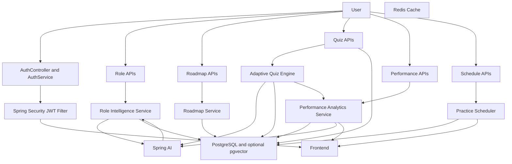

# AI Role-Based Adaptive Quiz & Preparation Platform — System Overview

This document provides:
- A high-level flow diagram
- A concise features list

---

## 1) End-to-End Application Flow

Key notes:
- JWT-based stateless auth with a custom filter secures all protected endpoints.
- Spring AI orchestrates prompts for skill extraction, quiz generation, and performance summaries.
- PostgreSQL persists core domain models; pgvector (optional) enables semantic retrieval for questions/skills.
- Redis (optional) can cache hot reads (e.g., role skills, next-question suggestions).

---

## 2) Code Structure & Working 

High-level architecture (Modular Monolith, Clean Architecture-inspired):
- Controller Layer (REST): Pure I/O boundary (request/response DTOs). No business logic.
- Service Layer: Orchestrates use-cases, enforces domain rules, and coordinates with repositories and AI providers.
- Repository Layer: Spring Data JPA interfaces for persistence. No business logic.
- Domain Models: JPA entities — User, Role, Skill, Roadmap, QuizQuestion, QuizAttempt, PracticeSchedule, RefreshToken.
- DTOs: Input/output shapes for API contracts, decoupled from entities.
- Mappers: Explicit mapping methods (no runtime reflection) between entities and DTOs for clarity and testability.
- AI Integration Layer: Spring AI client(s), prompt templates, and response parsers into strongly-typed DTOs.
- Config/Security/Exception: Cross-cutting concerns, global exception handling, JWT, CORS, OpenAPI.

Suggested package structure:
- controller
- service
- service.impl
- repository
- entity
- dto
- mapper
- ai (prompt templates, model providers, parsers)
- config (security, swagger, data, ai)
- exception (global handler, domain errors)
- util (common helpers)

How the system works (lifecycle):
- Authentication:
  - User registers/logs in. Passwords are BCrypt-hashed. JwtService issues short-lived access tokens + stored refresh tokens.
  - JwtAuthenticationFilter validates Bearer tokens and injects authorities (ROLE_USER/ROLE_ADMIN).
- Role Intelligence:
  - POST /roles/analyze takes a target role. Role service crafts a prompt (few-shot examples, instructions) and calls Spring AI.
  - The LLM response is parsed into a structured list of skills (name + priorityScore), persisted and linked to Role.
- Roadmap Generator:
  - Uses skill dependencies and estimated effort to order weekly milestones (Roadmap entries) and persists them.
- Adaptive Quiz Engine:
  - Chooses next skill/difficulty based on recent performance and coverage rules; avoids repetition.
  - For new or insufficiently covered skills, invokes Spring AI to generate questions (MCQ/scenario) with options, correct answer, explanation, and difficulty.
  - Stores questions and QuizAttempt results; updates personalization signals.
- Performance Analytics:
  - Aggregates skill-wise accuracy, computes readiness score (e.g., weighted performance across required skills).
  - Spring AI summarizes strengths/weaknesses in natural language. Skill gap detection compares performance vs required skills.
- Practice Scheduler:
  - Generates daily schedule using roadmap + analytics; prioritizes weak topics while maintaining progression.
- Extensibility:
  - Modular Monolith patterns (feature packages under the above layers) allow later slicing into microservices with minimal refactors.
  - Optional Redis caching and pgvector embeddings can be enabled for scale and semantic features.

Talking points (concise):
- Separation of concerns: controllers are thin; services contain business logic; repositories abstract persistence.
- DTOs + Mappers maintain contract stability and prevent entity leakage.
- Spring AI encapsulated behind AI services and templates for portability and unit testability.
- Security via JWT filter and role-based access. Stateless, scalable.
- Database schema normalized; supports analytics and scheduling with clear relations.
- Designed to evolve into microservices: clear module boundaries and minimal shared state.

---

## 3) Features Summary

Core Features:
- Role Intelligence Module
  - Extracts required skills from a target job role using Spring AI
  - Ranks skills by importance and persists mappings
- AI Roadmap Generator
  - Produces weekly learning milestones
  - Orders skills by dependency and estimates preparation time
- Adaptive Quiz Engine
  - AI-generated MCQs/scenario questions with options, correct answer, explanation, and difficulty tags
  - Tracks user performance and dynamically adapts difficulty/skill coverage
  - Avoids repetition and reinforces weak areas
- Performance Analytics
  - Skill-wise accuracy and progression metrics
  - Interview readiness score computation
  - LLM-generated strength/weakness narrative
  - Skill gap detection (required vs current performance)
- Practice Scheduler
  - Daily preparation schedule using roadmap + analytics
  - Prioritizes weak topics and maintains learning progression

Platform Features:
- Spring Boot + Java 17+, REST API with Swagger/OpenAPI
- Spring Data JPA/Hibernate with PostgreSQL (pgvector optional)
- Spring AI integration (configurable provider)
- Security: Spring Security, JWT, role-based access (USER/ADMIN)
- Docker & docker-compose for local/prod-like runs
- Validation via Jakarta Validation, logging via SLF4J/Logback
- Global exception handling and meaningful API error responses
- Unit tests emphasis on service layer and adaptive logic
- Modular Monolith architecture ready for microservice migration
- Optional performance extras: Redis caching, event-driven evaluations, gamification, multi-LLM support

---
